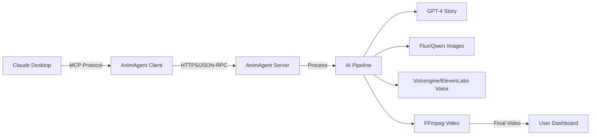

# AnimAgent MCP Client

<div align="center">


[](https://opensource.org/licenses/MIT)
[](https://nodejs.org)
[](https://modelcontextprotocol.io)
[](https://app.sumatman.ai)

**🎬 Create Professional AI-Powered Story Animations Directly from Claude Desktop**

[English](README.md) | [中文](README_CN.md)

</div>

---

## 🚀 One-Click Installation

### macOS/Linux:
```bash
git clone https://github.com/preangelleo/animagent-mcp-client.git && cd animagent-mcp-client && ./install.sh
```

### Windows:
```cmd
git clone https://github.com/preangelleo/animagent-mcp-client.git && cd animagent-mcp-client && install.bat
```

**That's it!** The installer automatically:
- ✅ Checks Node.js installation
- ✅ Installs all dependencies
- ✅ Guides you through credential setup
- ✅ Configures Claude Desktop for you
- ✅ Verifies the connection

---

## 🌟 What is AnimAgent?

AnimAgent is the **world's first MCP server for AI-generated story animations**. Transform your ideas into professional animated videos through natural conversation with Claude Desktop - no video editing skills required!

### ✨ Key Features

- **🎭 13 Story Types**: Fairytales, Sci-Fi, Educational, Romance, Adventure, and more
- **🌍 12 Languages**: English, Chinese, Spanish, French, Hindi, Arabic, and more
- **🎨 100+ Art Styles**: Ghibli, Pixar, Watercolor, Oil Painting, Comic, and more
- **⏱️ Flexible Duration**: 5 to 60 minutes
- **📱 Multiple Formats**: Landscape (16:9), Portrait (9:16), Square (1:1)
- **🚀 Cloud-Based**: No GPU required, all processing in the cloud
- **💬 Natural Language**: Just describe what you want in plain English


---

## 🎯 Quick Start Guide

### Step 1: Get Your Credentials (2 minutes)

1. **Register** at [app.sumatman.ai](https://app.sumatman.ai)
2. **Login** with your email
3. **Copy** your User ID from the Welcome page
4. **Remember** your email address

### Step 2: Install the Client (1 minute)

Run the one-click installer above, or manually:

```bash
# Clone and install
git clone https://github.com/preangelleo/animagent-mcp-client.git
cd animagent-mcp-client
npm install

# Configure credentials
cp .env.example .env
# Edit .env with your User ID and Email

# Setup Claude Desktop
npm run setup
```

### Step 3: Start Creating! (Instant)

In Claude Desktop, simply type:

```
"Create a 10-minute fairytale about a brave mouse discovering magical cheese"
```

---

## 💬 Usage Examples

### Basic Creation
```
"Create a children's story about friendship"
```

### With Full Customization
```
"Create a 15-minute sci-fi adventure in Japanese anime style, 
suitable for teenagers, with Chinese narration"
```

### Task Management
```
"Show me the status of my animation task"
"Edit task web_123_abc to change duration to 20 minutes"
"Repeat my last task but with a different story"
```

---

## 🛠️ Available Commands

| Command | Description | Example |
|---------|-------------|---------|
| **create_animation_task** | Create new animation | "Create a story about..." |
| **get_task_details** | Check task status | "Show task web_123_abc" |
| **edit_animation_task** | Modify pending task | "Edit task to change..." |
| **repeat_animation_task** | Create variation | "Repeat task with new story" |
| **delete_animation_task** | Remove pending task | "Delete task web_123_abc" |

---

## 🎨 Customization Options

<details>
<summary><b>📚 Story Types (13 options)</b></summary>

- `fairytale_story` - Magical fairytales
- `educational_story` - Learning content
- `historical_story` - Historical events
- `sci_fi_story` - Science fiction
- `fantasy_story` - Fantasy worlds
- `adventure_story` - Epic adventures
- `romantic_story` - Love stories
- `cinematic_story` - Movie-style
- `bible_story` - Biblical stories
- `poetry_story` - Poetic narratives
- `lyric_story` - Musical stories
- `comics_story` - Comic book style
- `book_story` - Book adaptations

</details>

<details>
<summary><b>🎨 Popular Art Styles</b></summary>

- **Animation Styles**: Ghibli, Pixar, Disney, Anime
- **Traditional Art**: Oil Painting, Watercolor, Chinese Ink
- **Modern Styles**: Digital Art, Vector Graphics, 3D Rendering
- **Unique Styles**: Steampunk, Cyberpunk, Fantasy Art

[View all 100+ styles with samples →](https://app.sumatman.ai/illustration-samples)

</details>

<details>
<summary><b>🌍 Supported Languages</b></summary>

English, Chinese, Spanish, French, Hindi, Arabic, Bengali, Portuguese, Russian, Japanese, German, Korean

</details>

---

## 🔧 Advanced Configuration

### Manual Claude Desktop Setup

If automatic setup doesn't work, manually edit Claude's config:

**macOS**: `~/Library/Application Support/Claude/claude_desktop_config.json`  
**Windows**: `%APPDATA%\Claude\claude_desktop_config.json`

```json
{
  "mcpServers": {
    "animagent": {
      "command": "node",
      "args": ["/path/to/animagent-mcp-client/src/index.js"],
      "env": {
        "ANIMAGENT_USER_ID": "your-user-id",
        "ANIMAGENT_USER_EMAIL": "your-email@example.com"
      }
    }
  }
}
```

### Environment Variables

| Variable | Description | Required |
|----------|-------------|----------|
| `ANIMAGENT_USER_ID` | Your user ID from app.sumatman.ai | ✅ Yes |
| `ANIMAGENT_USER_EMAIL` | Your registered email | ✅ Yes |
| `ANIMAGENT_MCP_SERVER_URL` | Server URL (default: https://app.sumatman.ai/api/mcp) | ❌ No |
| `DEBUG` | Enable debug logging | ❌ No |

---

## 🚨 Troubleshooting

### Common Issues & Solutions

<details>
<summary><b>❌ "Client Validation Error - TASK_ID IS MANDATORY"</b></summary>

**Solution**: Always provide the task ID when editing/repeating/deleting:
```
✅ "Edit task web_123_abc to change duration"
❌ "Edit my task to change duration"
```

</details>

<details>
<summary><b>❌ "User credentials not configured"</b></summary>

**Solution**:
1. Check your `.env` file has correct credentials
2. Verify User ID matches the one from app.sumatman.ai
3. Restart Claude Desktop after changes

</details>

<details>
<summary><b>❌ "Connection refused" or timeout errors</b></summary>

**Solution**:
1. Check internet connection
2. Verify https://app.sumatman.ai is accessible
3. Try `npm run test` to test connection
4. Check firewall/proxy settings

</details>

---

## 💰 Pricing

- **Credit System**: 50 credits per minute of video
- **Free Trial**: 100 credits on signup
- **Packages**: From $1 (10 credits) to $500 (7,000 credits)
- **View Balance**: [app.sumatman.ai/credits](https://app.sumatman.ai/credits)

---

## 🏗️ Architecture



---

## 🤝 Contributing

We welcome contributions! Please see our [Contributing Guide](CONTRIBUTING.md) for details.

```bash
# Fork and clone
git clone https://github.com/YOUR_USERNAME/animagent-mcp-client.git

# Create feature branch
git checkout -b feature/amazing-feature

# Commit changes
git commit -m 'Add amazing feature'

# Push and create PR
git push origin feature/amazing-feature
```

---

## 📄 License

This project is licensed under the MIT License - see the [LICENSE](LICENSE) file for details.

---

## 🆘 Support

- **Website**: [app.sumatman.ai](https://app.sumatman.ai)
- **GitHub Issues**: [Report a bug](https://github.com/preangelleo/animagent-mcp-client/issues)
- **Email**: support@sumatman.ai

---

## 🙏 Acknowledgments

- Built with [Model Context Protocol](https://modelcontextprotocol.io) by Anthropic
- Powered by [Sumatman AI](https://animagent.ai)
- Special thanks to all our early adopters and contributors

---

<div align="center">

**⭐ Star us on GitHub if you find this useful!**

[🌟 Star](https://github.com/preangelleo/animagent-mcp-client) · 
[🐛 Report Bug](https://github.com/preangelleo/animagent-mcp-client/issues) · 
[💡 Request Feature](https://github.com/preangelleo/animagent-mcp-client/issues)

Made with ❤️ by [Sumatman AI](https://animagent.ai)

</div>