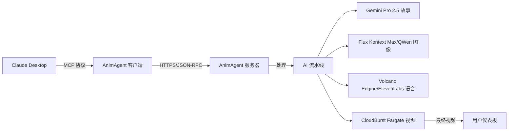

# AnimAgent MCP 客户端

<div align="center">


[](https://opensource.org/licenses/MIT)
[](https://nodejs.org)
[](https://modelcontextprotocol.io)
[](https://app.sumatman.ai)

**🎬 直接在 Claude Desktop 中创建专业的 AI 故事动画**

[English](README.md) | [中文](README_CN.md)

</div>

---

## 🚀 一键安装

### macOS/Linux:
```bash
git clone https://github.com/preangelleo/animagent-mcp-client.git && cd animagent-mcp-client && ./install.sh
```

### Windows:
```cmd
git clone https://github.com/preangelleo/animagent-mcp-client.git && cd animagent-mcp-client && install.bat
```

**就这么简单！** 安装程序会自动：
- ✅ 检查 Node.js 安装
- ✅ 安装所有依赖项
- ✅ 引导您设置凭据
- ✅ 为您配置 Claude Desktop
- ✅ 验证连接

---

## 🌟 什么是 AnimAgent？

AnimAgent 是**全球首个 AI 生成故事动画的 MCP 服务器**。通过与 Claude Desktop 的自然对话，将您的想法转化为专业的动画视频 - 无需任何视频编辑技能！

### ✨ 核心特性

- **🎭 13 种故事类型**：童话、科幻、教育、浪漫、冒险等
- **🌍 12 种语言**：英语、中文、西班牙语、法语、印地语、阿拉伯语等
- **🎨 18 种艺术风格**：吉卜力、皮克斯、水彩、油画、漫画等
- **⏱️ 灵活时长**：5 到 60 分钟
- **📱 多种格式**：横屏 (16:9)、竖屏 (9:16)、方形 (1:1)
- **🚀 云端处理**：无需 GPU，所有处理都在云端完成
- **💬 自然语言**：用中文描述您想要的内容即可


---

## 🎯 快速开始指南

### 第 1 步：获取您的凭据（2 分钟）

1. **注册** [app.sumatman.ai](https://app.sumatman.ai)
2. **登录**您的账号
3. **复制**欢迎页面上的 User ID
4. **记住**您的注册邮箱

### 第 2 步：安装客户端（1 分钟）

运行上面的一键安装程序，或手动安装：

```bash
# 克隆并安装
git clone https://github.com/preangelleo/animagent-mcp-client.git
cd animagent-mcp-client
npm install

# 配置凭据
cp .env.example .env
# 编辑 .env 文件，填入您的 User ID 和邮箱

# 设置 Claude Desktop
npm run setup
```

### 第 3 步：开始创作！（立即）

在 Claude Desktop 中，只需输入：

```
"创建一个10分钟的童话故事，关于一只勇敢的小老鼠发现魔法奶酪"
```

---

## 💬 使用示例

### 基础创建
```
"创建一个关于友谊的儿童故事"
```

### 完全自定义
```
"创建一个15分钟的科幻冒险故事，使用日本动漫风格，
适合青少年观看，用中文配音"
```

### 使用高级选项
```
"创建一个带字幕和缩放特效的教育故事"
```

### 任务管理
```
"显示我的动画任务状态"
"编辑任务 web_123_abc，将时长改为20分钟"
"重复上一个任务，但使用不同的故事"
```

---

## 🛠️ 可用命令

| 命令 | 描述 | 示例 |
|------|------|------|
| **create_animation_task** | 创建新动画 | "创建一个关于...的故事" |
| **get_task_details** | 查看任务状态 | "显示任务 web_123_abc" |
| **edit_animation_task** | 修改待处理任务 | "编辑任务以更改..." |
| **repeat_animation_task** | 创建变体 | "用新故事重复任务" |
| **delete_animation_task** | 删除待处理任务 | "删除任务 web_123_abc" |

### 🎬 高级视频选项 (v2.2.0)

| 选项 | 类型 | 默认值 | 描述 |
|------|------|--------|------|
| **enable_subtitle** | 布尔值 | false | 为视频添加同步字幕 |
| **enable_zoom_effect** | 布尔值 | false | 添加电影级缩放特效，让画面更生动 |
| **watermark_enabled** | 布尔值 | false | 添加自定义水印（需先在 app.sumatman.ai 上传）|

---

## 🎨 自定义选项

<details>
<summary><b>📚 故事类型（13 种选项）</b></summary>

- `fairytale_story` - 魔法童话
- `educational_story` - 教育内容
- `historical_story` - 历史事件
- `sci_fi_story` - 科幻故事
- `fantasy_story` - 奇幻世界
- `adventure_story` - 史诗冒险
- `romantic_story` - 爱情故事
- `cinematic_story` - 电影风格
- `bible_story` - 圣经故事
- `poetry_story` - 诗歌叙事
- `lyric_story` - 音乐故事
- `comics_story` - 漫画风格
- `book_story` - 书籍改编

</details>

<details>
<summary><b>🎨 流行艺术风格</b></summary>

- **动画风格**：吉卜力、皮克斯、迪士尼、动漫
- **传统艺术**：油画、水彩、中国水墨
- **现代风格**：数字艺术、矢量图形、3D 渲染
- **独特风格**：蒸汽朋克、赛博朋克、奇幻艺术

[查看所有 18 种风格示例 →](https://animagent.ai/illustration-styles)

</details>

<details>
<summary><b>🌍 支持的语言</b></summary>

英语、中文、西班牙语、法语、印地语、阿拉伯语、孟加拉语、葡萄牙语、俄语、日语、德语、韩语

</details>

---

## 🔧 高级配置

### 手动配置 Claude Desktop

如果自动设置不起作用，请手动编辑 Claude 的配置文件：

**macOS**: `~/Library/Application Support/Claude/claude_desktop_config.json`  
**Windows**: `%APPDATA%\Claude\claude_desktop_config.json`

```json
{
  "mcpServers": {
    "animagent": {
      "command": "node",
      "args": ["/path/to/animagent-mcp-client/src/index.js"],
      "env": {
        "ANIMAGENT_USER_ID": "您的用户ID",
        "ANIMAGENT_USER_EMAIL": "您的邮箱@example.com"
      }
    }
  }
}
```

### 环境变量

| 变量 | 描述 | 必需 |
|------|------|------|
| `ANIMAGENT_USER_ID` | 来自 app.sumatman.ai 的用户 ID | ✅ 是 |
| `ANIMAGENT_USER_EMAIL` | 您的注册邮箱 | ✅ 是 |
| `ANIMAGENT_MCP_SERVER_URL` | 服务器 URL（默认：https://app.sumatman.ai/api/mcp） | ❌ 否 |
| `DEBUG` | 启用调试日志 | ❌ 否 |

---

## 🚨 故障排除

### 常见问题和解决方案

<details>
<summary><b>❌ "客户端验证错误 - TASK_ID 是必需的"</b></summary>

**解决方案**：编辑/重复/删除时始终提供任务 ID：
```
✅ "编辑任务 web_123_abc 以更改时长"
❌ "编辑我的任务以更改时长"
```

</details>

<details>
<summary><b>❌ "未配置用户凭据"</b></summary>

**解决方案**：
1. 检查 `.env` 文件中的凭据是否正确
2. 验证 User ID 是否与 app.sumatman.ai 中的匹配
3. 更改后重启 Claude Desktop

</details>

<details>
<summary><b>❌ "连接被拒绝"或超时错误</b></summary>

**解决方案**：
1. 检查互联网连接
2. 验证 https://app.sumatman.ai 是否可访问
3. 尝试运行 `npm run test` 测试连接
4. 检查防火墙/代理设置

</details>

---

## 💰 价格

- **积分系统**：每分钟视频 50 积分
- **免费试用**：注册送 100 积分
- **套餐**：从 $1（10 积分）到 $500（7,000 积分）
- **查看余额**：[app.sumatman.ai/credits](https://app.sumatman.ai/credits)

---

## 🏗️ 技术栈

### AI 驱动组件

- **📝 故事创作**：Google Gemini Pro 2.5 将您的想法转化为引人入胜的叙事和结构化故事线，为每个场景生成图像描述
- **🎤 专业配音**：Volcano Engine 提供地道的中文语音生成，ElevenLabs 负责国际语音和字幕强制对齐
- **🎨 视觉生成**：先进的 Flux Kontext Max 和 QWen 模型确保一致、精美的场景生成，并正确渲染文字
- **🎬 视频处理**：CloudBurst Fargate 实现并行视频处理 - 无论场景数量多少都能快速渲染

## 🏗️ 架构



---

## 🤝 贡献

我们欢迎贡献！请查看我们的[贡献指南](CONTRIBUTING.md)了解详情。

```bash
# Fork 并克隆
git clone https://github.com/YOUR_USERNAME/animagent-mcp-client.git

# 创建功能分支
git checkout -b feature/amazing-feature

# 提交更改
git commit -m '添加了不起的功能'

# 推送并创建 PR
git push origin feature/amazing-feature
```

---

## 📄 许可证

本项目采用 MIT 许可证 - 详见 [LICENSE](LICENSE) 文件。

---

## 🆘 支持

- **官网**：[app.sumatman.ai](https://app.sumatman.ai)
- **GitHub Issues**：[报告错误](https://github.com/preangelleo/animagent-mcp-client/issues)
- **邮箱**：support@sumatman.ai

---

## 🙏 致谢

- 基于 Anthropic 的 [Model Context Protocol](https://modelcontextprotocol.io) 构建
- 由 [Sumatman AI](https://animagent.ai) 提供支持
- 特别感谢所有早期用户和贡献者

---

<div align="center">

**⭐ 如果您觉得有用，请在 GitHub 上给我们星标！**

[🌟 星标](https://github.com/preangelleo/animagent-mcp-client) · 
[🐛 报告错误](https://github.com/preangelleo/animagent-mcp-client/issues) · 
[💡 请求功能](https://github.com/preangelleo/animagent-mcp-client/issues)

由 [Sumatman AI](https://animagent.ai) 用 ❤️ 制作

</div>